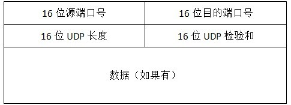
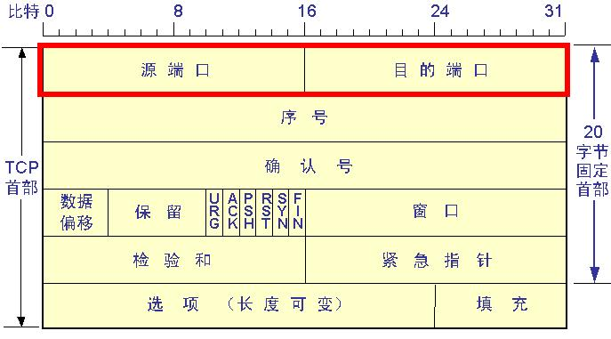
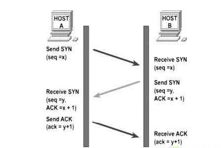
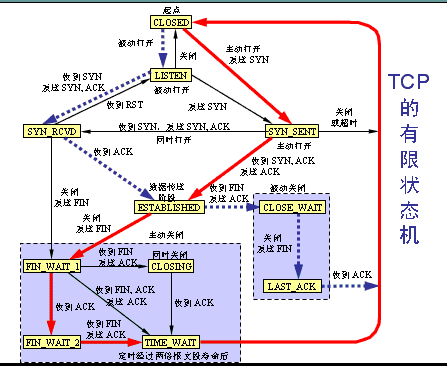

网络要素：规范或协议、消息、介质、设备。

通信要素：消息来源或发送放、目的的或接受方、通道

网络表示方式：1、网络接口卡(NIC),可以理解成一个网卡或者网络适配器。
              2、物理接口，一个连接器或者网络设备上的一个插孔
              3、接口，能使两个不同的网络进行通信的设备。最简单的比如路由器

OSI（开放式系统互联）模型，分七层，自上而下依次为：应用层、表示层、会话层、传输层、网络层、数据链路层、物理层。

TCP／IP模型，分四层：应用层、传输层、网络层、网络接口层。

TCP／IP的应用层即为OSI的应用层、表示层、会话层；传输层和网络层，两种模型一样；网络接口层为数据链路层、物理层。

网络模型是网络工作原理的表示方式。并非实际网络。

TCP／IP每一层的功能：
	应用层：为用户表示应用数据。
	传输层：支持设备见的通信和执行错误纠正
	网际层：确定通过网络的最佳路径
	网络接口层：控制网络的硬件设备和介质

完整的通信过程：
	1、发送方终端设备应用层创建数据
	2、当数据在源终端设备中沿协议族向下传递时对其分段和封装
	3、在协议族网络接口层的介质上生成数据
	4、通过由介质和任意中间设备组成的网际网络传输数据
	5、在目的终端设备的网络接口层接收数据
	6、当数据在目的设备中沿协议族向上传递时对其解封和重组
	7、将此数据传送到目的终端设备应用层的应用程序

其实简单的可以这么说：应用层创建数据出来，传输层里确定网络传输的方式，比如tcp还是udp，数据再向下打包在网际层打上ip包信息，再打上mac信息，最后听过截止发送至网络链路中。接收数据就是一个个解包的过程。
	
	物理层：定时和同步位
	数据链路层：目的mac地址和源mac地址
	网络层：目的ip地址和源ip地址
	传输层：目的端口号和源端口号，以及传输协议
	应用层：加密的应用层数据

DNS、HTTP、SMTP、Telnet、FTP这些都是比较常见的应用层协议，都在应用层中。

#传输层

UDP:UDP是不可靠链接，是一种简单的无链接协议。它的有点在于开销低，缺点是它的不可靠性。UDP只需要8字节的开销

UDP协议的常见应用：DNS；视频流；ip语音

UDP数据报头：

TCP是一种面向连接的协议，为实现这个额外的功能，会产生额外的开销。但是它的数据可靠。TCP需要20自己的开销。

TCP的常见应用：WEB浏览器、电子邮件、文件传输程序

TCP数据报头：

端口，不同的程序，无论TCP或UDP都有自己特有的端口号，可以通过这个端口号，实现两个不同的应用程序数据的收发。

	0－1023是知名端口号。如telnet是23（TCP）
	1024－49151是已注册端口号。如8080（HTTP）是HTTP的备用端口。
	49142－65535是动态或私有端口。这些端口客户端一般很少使用，是动态分配的。
有些端口是TCP、UDP同时使用的，如DNS：53、SNMP：161

TCP
____________
TCP三握手：客户端发送：SYNC；服务器收到SYNC后发送SYNC＋ACK；客户端收到服务器的消息后再发送ACK。如上三步链接建立。
图：

TCP会话终止是双向终止的，分四部：客户端发送FIN；服务器收到FIN后，发送ACK；服务器再向客户端发送FIN；客户端接收到FIN后，再发送ACK至服务器。

图：

TCP状态转换图：

TCP的流控，当发现有阻塞的时候，接收主机会让发送客户端，窗口减半。如客户端向主机先发送了1－3000的数据，主机发回确认号3001。但是在发3001－6000的时候，3001－4500的数据，主机没接收到，主机只收到4501－6000。所以主机会发报文给客户机，报文的确认码是3001，窗口值是1500。所以下次客户机发的数据就是3001－4500，窗口已经变成了1500。这个就是TCP的流控。
TCP流控图，图见书本P81页。

UDP是不可靠连接，所以对于丢失的数据进行重发。且仅将接收的数据按照先来后到的顺序转发到应用程序。如果数据的顺序对应用程序很重要，那么应用程序只能自己标志数据的正确顺序，并决定如何处理这些数据。

#网络层

网络层的四个基本任务：
	1、用IP地址编址
	2、封装
	3、路由
	4、解封装

路由的作用就是确定数据发向那一个跳
IPV4报头：
	

TTL,8位TTL字段描述的是数据包被丢弃或可传输之前可经过的最大跳数，每个经过没有路由器减1。
路由：设备不知道目的设备的地址，就把数据发给默认网管。路由器负责对到达网关接口的每个数据包作出转发决定，此转发过程称之为路由。
路由表的三个主要特点：目的网络，下一跳，度量。

